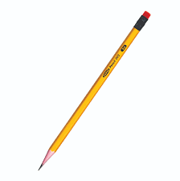

# Testing pencil

## Requirements

* Basic Functionality

    > Մատիտը պետք է գրի։

* Boundary conditions

    > Մատիտի միջուկը պետք է լինի նեղ, գրչաման փայտի մեջ։

* Stress conditions

    > Մատիտը չպետք է կոտրվի ընկնելիս կամ երբ այն վերցնենք մեր ձեռքը։

* Usability

    > Մատիտը պետք է հարմար լինի բռնել։

* Security/safety 

    > Արդյո՞ք մատիտի ներկը վնասակար է։

## Test approach

- Experience-based testing 

    1. Մատիտը սրելիս չպետք է ջարդվի։
    2. Ռետինով ջնջելիս պետք է մաքրվի։ 
    3. Գրելիս միանգամից չպետք է վերջանա։
    4. Անընդհատ չպետք է կոտրվի գրելու ընթացքում։ 
    5. Քանի որ մեր մատիտը HB է, այն չպետք է լինի ո՛չ շատ փափուկ, ո՛չ շատ չոր, այլ միջին փափկության։

- Coverage-based testing

    1. Մատիտը պետք է գրի թղթի վրա։
    2. Ջուրն ընկնելիս մատիտը չպետք է հալվի, փչանա։

---

Test-ի արդյունքում պարզվեց, որ տվյալ մատիտը համապատասխանում է մեր՝ վերը նշած պայմաններին, և այն ենթակա է անվտանգ օգտագործման։

